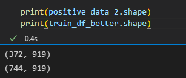
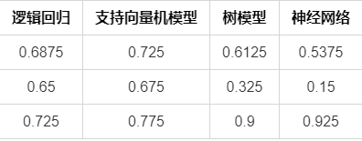
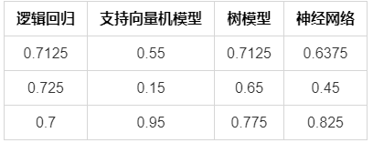

---
title: 基于机器学习的乳腺癌影像分析
date: 2023.1.02
tags:    
   - 项目
categories: 
   - 项目
keywords:
description:
cover: /img/回忆杀/p2019255582.webp
top_img: /img/回忆杀/p2019255582.webp
comments: 
---
# 基于机器学习的乳腺癌影像分析
## **异常检测**
### **数据集划分**
使用留出法，将1345个数据分出1000个训练集和345个测试集

训练集中良性占63％，恶性占37%

测试集中良性占79%，恶性占21%

训练集导出至train\_data.csv

测试集导出至test\_data.csv

||**N（0，良性）**|**P（1，恶性）**|
| :- | :- | :- |
|训练集|634|366|
|测试集|273|72|
### **DBSCAN**
#### **思路及原理**
DBSCAN的算法步骤比较简单，主要分成两步。
##### **1、寻找核心点形成临时聚类簇**
扫描全部样本点，如果某个样本点R半径范围内点数目>=MinPoints，则将其纳入核心点列表，并将其密度直达的点形成对应的临时聚类簇。
##### **2、合并临时聚类簇得到聚类簇**
对于每一个临时聚类簇，检查其中的点是否为核心点，如果是，将该点对应的临时聚类簇和当前临时聚类簇合并，得到新的临时聚类簇。

重复此操作，直到当前临时聚类簇中的每一个点要么不在核心点列表，要么其密度直达的点都已经在该临时聚类簇，该临时聚类簇升级成为聚类簇。

继续对剩余的临时聚类簇进行相同的合并操作，直到全部临时聚类簇被处理。反复寻找这些核心点直接密度可达或密度可达的点，将其加入到相应的类，对于核心点发生密度可达状况的类，给予合并


DBSCAN算法可以抽象为以下几步：

1）找到每个样本的邻域内的样本个数，若个数大于等于MinPts，则该样本为核心点；

2）找到每个核心样本密度直达和密度可达的样本，且该样本亦为核心样本，忽略所有的非核心样本；

3）若非核心样本在核心样本的邻域内，则非核心样本为边界样本，反之为噪声。

使用轮廓系数作为判断聚类好坏的依据

[轮廓系数](https://so.csdn.net/so/search?q=%E8%BD%AE%E5%BB%93%E7%B3%BB%E6%95%B0&spm=1001.2101.3001.7020)（Silhouette Coefficient），是聚类效果好坏的一种评价方式。最早由 Peter J. Rousseeuw 在 1986 提出。它结合内聚度和分离度两种因素。可以用来在相同原始数据的基础上用来评价不同算法、或者算法不同运行方式对聚类结果所产生的影响。

`         `**方法：**

`                  `1，计算样本i到同簇其他样本的平均距离ai。ai 越小，说明样本i越应该被聚类到该簇。将ai 称为样本i的**簇内不相似度**。

`                            `**簇C中所有样本的a i 均值称为簇C的簇不相似度。**

`                  `2，计算样本i到其他某簇Cj 的所有样本的平均距离bij，称为样本i与簇Cj 的不相似度。定义为样本i的**簇间不相似度**：bi =min{bi1, bi2, ..., bik}

`                            `**bi越大，说明样本i越不属于其他簇。**

`                   `3，根据样本i的簇内不相似度a i 和簇间不相似度b i ，定义样本i的**轮廓系数**：


`                   `4，判断：

`                            `si接近1，则说明样本i聚类合理；

`                            `si接近-1，则说明样本i更应该分类到另外的簇；

`                            `若si 近似为0，则说明样本i在两个簇的边界上。


`         `**所有样本的s i 的均值称为聚类结果的轮廓系数，是该聚类是否合理、有效的度量。**
#### **实现方法**
分别对良性和恶性样本分别进行DBSCAN聚类分析，以下以良性为例说明：

导入包和类
```
import numpy as np 
import sklearn.cluster as skc  # 密度聚类
from sklearn import metrics   # 评估模型
```
预处理数据

对良性样本训练
```
label1_df = df[df['label'] == 1]
print(label1_df.shape)

label1_data = label1_df.drop(['subjectName','label','肿瘤类型','mark','QC'],axis=1)
```
主要函数

重要参数：eps：轮廓半径  min\_samples：最小样本量

```
#设置半径为2880，最小样本量为19，遍历得轮廓系数最高 0.8164716886625932
db = skc.DBSCAN(eps=1500, min_samples = 15).fit(label1_data) #DBSCAN聚类方法 还有参数，matric = ""距离计算方法
label1_df['labels'] = db.labels_
labels = db.labels_  #和X同一个维度，labels对应索引序号的值 为她所在簇的序号，也就是聚类之后的结果。若簇编号为-1，表示为噪声
```
完整代码
```
import numpy as np 
import sklearn.cluster as skc  # 密度聚类
from sklearn import metrics   # 评估模型

# 对良性样本训练
label1_df = df[df['label'] == 1]
print(label1_df.shape)

label1_data = label1_df.drop(['subjectName','label','肿瘤类型','mark','QC'],axis=1)
#设置半径为2880，最小样本量为19，遍历得轮廓系数最高 0.8164716886625932
db = skc.DBSCAN(eps=1500, min_samples = 15).fit(label1_data) #DBSCAN聚类方法 还有参数，matric = ""距离计算方法
label1_df['labels'] = db.labels_
labels = db.labels_  #和X同一个维度，labels对应索引序号的值 为她所在簇的序号，也就是聚类之后的结果。若簇编号为-1，表示为噪声

print('每个样本的簇标号:')
print(labels)
raito = len(labels[labels[:] == -1]) / len(labels)  #计算噪声点个数占总数的比例
print('噪声比:', format(raito, '.2%'))
 
n_clusters_ = len(set(labels)) - (1 if -1 in labels else 0)  # 获取分簇的数目
 
print('分簇的数目: %d' % n_clusters_)
print("轮廓系数: %0.3f" % metrics.silhouette_score(label1_data, labels)) #轮廓系数评价聚类的好坏
 
print('噪声的所有样本:')
new_cluster = label1_data[labels == -1]
print(new_cluster.shape)

import numpy as np
from sklearn.manifold import TSNE
import matplotlib.pyplot as plt
from sklearn import manifold, datasets
new_cluster_1 = label1_data[labels == 0]
# t-SNE的降维与可视化
ts = manifold.TSNE(n_components=2, init='pca', random_state=0)
# 训练模型
y = ts.fit_transform(new_cluster_1)
x = ts.fit_transform(new_cluster)
plt.scatter(y[:, 0], y[:, 1], cmap=plt.cm.Spectral)
plt.scatter(x[:, 0], x[:, 1], cmap=plt.cm.Spectral)
# 显示图像
plt.show()
```
#### **结果**
遍历得轮廓系数最高的参数选择后结果


聚类结果


实验测试结果如下：

|**逻辑回归**|**准确性**|**灵敏度**|**特异性**|
| :- | :- | :- | :- |
|未做筛选|0.50|0.875|0.403|
|DBSCAN|0.604|0.681|0.546|


|**支持向量机**|**准确性**|**灵敏度**|**特异性**|
| :- | :- | :- | :- |
|未做筛选|0.409|0.917|0.275|
|DBSCAN|0.644|0.611|0.615|


|**LightGBM**|**准确性**|**灵敏度**|**特异性**|
| :- | :- | :- | :- |
|未做筛选|0.8|0.389|0.908|
|DBSCAN|0.814|0.306|0.901|


|**XGBoost**|**准确性**|**灵敏度**|**特异性**|
| :- | :- | :- | :- |
|未做筛选|0.794|0.403|0.897|
|DBSCAN|0.811|0.292|0.901|


|**神经网络**|**准确性**|**灵敏度**|**特异性**|
| :- | :- | :- | :- |
|未做筛选|0.339|0.916|0.187|
|DBSCAN|0.517|0.736|0.429|
根据对比发现，DBSCAN使各个模型的准确度都有一定程度的提升，但对灵敏度和特异性的影响有好有坏。
### **置信学习**
#### **思路及原理**
对噪声数据进行自动过滤，我们尝试采用置信学习（CL）的方法，CL 基于噪声数据剪枝的原理以计数的方式对噪声进行评估，并对数据集进行排序以进行置信训练。

在 Angluin 和Laird 分类噪声的假设基础上，将 CL 泛化到直接估计噪声标签和无损标签之间的联合分布。

实现置信学习，首先估计噪声标签和真实标签的联合分布，然后找出并过滤掉错误样本，最后过滤错误样本后，重新训练。

为获取上述的联合分布，需要使用cheanlab包下的find\_label\_issues函数，对“每个样本实际属于哪个类别”，“模型预测每个样本在每个类别的概率“，”选择是否是噪声数据的策略”这三个参数设置


#### **实现方法**
导入置信学习的cheanlab
```
from cleanlab.classification import CleanLearning
from cleanlab.filter import find_label_issues
```
所用到的方法及变量解释
```
ordered_label_issues = find_label_issues(
    labels=train_label, # 每个样本实际属于哪个类别
    pred_probs = grid_model.predict_proba(train_data),  # 模型预测每个样本在每个类别的概率
    return_indices_ranked_by='self_confidence', #选择是否是噪声数据的策略
)
print(ordered_label_issues.shape)
```
完整代码
```
from cgi import print_arguments
from cleanlab.classification import CleanLearning
from cleanlab.filter import find_label_issues
import numpy as np

ordered_label_issues = find_label_issues(
    labels=train_label, # 每个样本实际属于哪个类别
    pred_probs = grid_model.predict_proba(train_data),  # 模型预测每个样本在每个类别的概率
    return_indices_ranked_by='self_confidence', #选择是否是噪声数据的策略
)
print(ordered_label_issues.shape)
# 将良性和恶性的分开
noise_data11 = noise_data1[noise_data1['label'] == 1]
noise_data10 = noise_data1[noise_data1['label'] == 0]
cleaned_data11 = cleaned_data1[cleaned_data1['label'] == 1]
cleaned_data10 = cleaned_data1[cleaned_data1['label'] == 0]
cleaned_data11.to_csv('./可视化/cleaned_data11.csv',index = False)
cleaned_data10.to_csv('./可视化/cleaned_data10.csv',index = False)
```
#### **结果**


总结：以上结果表明比未优化稍微好一点，但相差不大。
### **孤立森林**
#### **思路及原理**
孤立森林根据离群点与正常值较为疏离，容易被孤立的特点，通过建立决策树，将离群点分离出来（异常样本更容易快速落入叶子结点，距离根节点更近）。


再利用集成学习bagging的思想，建立多颗决策树，在多棵树上都会被较先分离出来的就是离群点，用异常得分作为判断依据（sklearn中label是1为正常值，-1为异常值）


实现思路：

先把两个训练集和一个测试集数据合在一起，通过label标签将良恶性分开，再各自通过离群点检测算法，将离群点筛选出来，完成后放入各模型中测试，并与不做处理的结果进行对比


#### **实现方法**
使用sklearn中的孤立森林模型

先导入sklearn中的孤立森林包

from sklearn.ensemble import IsolationForest

所用到的方法

sklearn.ensemble.IsolationForest( n\_estimators=100,  max\_samples='auto',  contamination='auto',  max\_features=1.0, bootstrap=False,  n\_jobs=None,  random\_state=None,  verbose=0,  warm\_start=False )

参数解释如下：

n\_estimators : iTree的个数，指定该森林中生成的随机树数量，默认为100个max\_samples : 构建子树的样本数。如果设置的是"auto"，则max\_samples=min(256, n\_samples)，n\_samples即总样本的数量

contamination :取值范围为(0., 0.5),表示异常数据占给定的数据集的比例

max\_features : 构建每个子树的特征数字

bootstrap :采样是有放回还是无放回

random\_state :每次训练的随机性

具体实现代码如下：
```
import pandas as pd
from sklearn.ensemble import IsolationForest

# 将良性和恶性的分开
label1_df = df[df['label'] == 1]
label0_df = df[df['label'] == 0]
# 进行训练
iforest = IsolationForest(n_estimators=100, max_samples='auto',  
                          contamination='auto', max_features=10,  
                          bootstrap=False, n_jobs=-1, random_state=1)
# 对恶性的进行孤立森林
train_data = label1_df.drop(['subjectName','label','肿瘤类型','mark','QC'], axis=1)
label1_df['anomaly_label'] = iforest.fit_predict(train_data) 
label1_df['scores'] = iforest.decision_function(train_data)
print(label1_df[label1_df.anomaly_label == -1].shape)
# 对良性的进行孤立森林
train_data = label0_df.drop(['subjectName','label','肿瘤类型','mark','QC'], axis=1)
label0_df['anomaly_label'] = iforest.fit_predict(train_data) 
label0_df['scores'] = iforest.decision_function(train_data)
print(label0_df[label0_df.anomaly_label == -1].shape)
# 再将恶性和良性的结果拼在一起
df = pd.concat([label1_df,label0_df], axis = 0)
# 删除异常值
df = df[df.anomaly_label == 1]
df = df.drop(['anomaly_label','scores'], axis=1)
print(df.shape)
```
#### **结果**
对异常类型和非异常类型做直方图分布可视化如下

训练集v1（688），v2（73）+测试集（80），共841个样本

经过独立森林筛选后，从训练集中筛掉67个样本，从测试集中删掉7个，一共74个（良性22个，恶性52个），剩余样本767个


实验测试结果如下：

|**逻辑回归**|**准确性**|**灵敏度**|**特异性**|
| :- | :- | :- | :- |
|未做筛选|0.625|0.3|0.95|
|孤立森林|0.712|0.675|0.625|


|**支持向量机**|**准确性**|**灵敏度**|**特异性**|
| :- | :- | :- | :- |
|未做筛选|0.7625|0.775|0.75|
|孤立森林|0.767|0.675|0.725|


|**LightGBM**|**准确性**|**灵敏度**|**特异性**|
| :- | :- | :- | :- |
|未做筛选|0.7125|0.5|0.925|
|孤立森林|0.67|0.425|0.825|


|**XGBoost**|**准确性**|**灵敏度**|**特异性**|
| :- | :- | :- | :- |
|未做筛选|0.7|0.5|0.9|
|孤立森林|0.725|0.5|0.825|


|**神经网络**|**准确性**|**灵敏度**|**特异性**|
| :- | :- | :- | :- |
|未做筛选|0.6375|0.3|0.875|
|孤立森林|0.575|0.15|0.9|
#### **结果可视化**
##### **使用matplotlib做可视化**
利用matplotlib对年龄，肿瘤大小，乳房大小，肿瘤类型中的全部值，正常值和异常值分别做良恶性人数可视化。其中年龄和肿瘤大小为数值型数据，使用直方图进行可视化；乳房大小和肿瘤类型为文本型数据，使用条形图做可视化，可视化结果如下


##### **使用Excel做可视化**
使用Excel对全部数据，正常值，和异常值的良恶性样本所占比例进行可视化分析，观察在年龄，肿瘤大小，乳房大小上数据的分布特征，对后续优化提供建议。

如在肿瘤大小中，观察到小于0.6的样本中基本为良性，则在后续模型训练时，可对这一范围内的样本加大良性判定权重。


## **特征筛选**
### **正负样本**
#### **思路及原理**
原测试数据集中包含189个正样本（label=1）502个负样本，其中测试数据集由train\_data\_v1.csv组成，正样本数量过低可能使测试中的准确度，灵敏度及特异性降低，故采用过采样与欠采样结合的方式均衡正负样本比例。

**过采样：**重复正比例数据，实际上没有为模型引入更多数据，过分强调正比例数据，会放大正比例噪音对模型的影响。

**欠采样**：丢弃大量数据，和过采样一样会存在过拟合的问题。

为防止单一使用过采样或欠采样导致样本类型过拟合，计划过采样正样本的两倍，并选择同等数量的负样本使其均衡。
#### **实现**
过采样三倍正样本

positive\_data = train\_df[train\_df['label']==1]
positive\_data\_2 = positive\_data.append(positive\_data)

欠采样与正样本相同数量的负样本

negative\_data = train\_df[train\_df['label']==0].sample(n=372,random\_state=1)
train\_df\_better = negative\_data.append(positive\_data\_2)

最终正负样本数：372+372=744个


#### **结果**
比较准确度，灵敏度及特异性改变情况

未使用正负样本均衡



优化后结果



优化结果分析

对逻辑回归、树模型和神经网络有一定的优化效果，但对支持向量机模型效果较少，对灵敏度特异性的优化程度较低，波动较大，且可能存在数据本身存在异常的影响。
### **PCA**
#### **思路及原理**
所给的数据集（data\_v1\_allFeatures.csv）中有290个特征，我们尝试在特征筛选阶段，使用PCA降维的方式对数据做降维处理，以加快模型训练速度，尝试提高模型的准确度，灵敏度及特异性。

PCA即主成分分析，其通过投影的方式将高维的数据映射到低维的空间中，并保证在所投影的维度上，原数据的信息量最大，从而使用较少的数据维度，保留住较多的原始数据特性。

如下图例子所示，通过变换坐标轴的方式，消除了三个样本点的x2轴（即x2特征），将二维数据降为一维，同时保证了三个样本点的区分度


#### **实现方法**
使用sklearn中的PCA模型

先导入sklearn中的PCA包

from sklearn.decomposition import PCA

其函数所需参数为

sklearn.decomposition.PCA(n\_components=None, copy=True, whiten=False)

n\_components: PCA算法中所要保留的主成分个数n，也即保留下来的特征个数n

copy:表示是否在运行算法时，将原始训练数据复制一份

whiten：白化，使得每个特征具有相同的方差

使用到的方法有

fit(X,y=None)  # 表示用数据X来训练PCA模型。因为PCA是无监督学习算法，此处y自然等于None。
fit\_transform(X) # 用X来训练PCA模型，同时返回降维后的数据￥
inverse\_transform() # 将降维后的数据转换成原始数据
transform(X) # 将数据X转换成降维后的数据。当模型训练好后，对于新输入的数据，都可以用transform方法来降维。

实现代码如下：

读入数据集后，先取出label，mark两列保存下来，再将数据集中用不到的5列删除

取主成分个数为80进行模型训练，将训练结果与先前存下来的label，mark两列保存到文件（selectFeatureDataTopPCA.csv）
```
from sklearn.decomposition import PCA
import matplotlib.pyplot as plt
import numpy as np
import pandas as pd
#导入数据
df5 = pd.read_csv('./data/data_v1_allFeatures.csv',encoding = 'utf-8')
df5_label = df5['label']
df5_mark = df5['mark']
data5 = df5.drop(['subjectName','label','肿瘤类型','mark','QC'],axis=1)
print(data5.shape)

'''
pca_line = PCA().fit(data5)
pca_line.explained_variance_ratio_
plt.figure(figsize=[200,5])
plt.xticks(np.linspace(0,290,290,endpoint=True))
plt.plot(np.cumsum(pca_line.explained_variance_ratio_))
plt.xlabel("number of components after dimension reduction")
plt.ylabel("cumulative explained variance ratio")
plt.show()
'''

newdf = PCA(n_components=80).fit_transform(data5)
newdf = pd.DataFrame(newdf)
newdf['label'] = df5_label
newdf['mark'] = df5_mark
print(newdf.shape)
newdf.to_csv('./selectFeatureDataTopPCA.csv',index = False)
```
#### **结果**
在PCA中，信息用方差来表示

explained\_variance：降维后的方差

通过绘制图像来观察，在不同保留维度下，降维后所有成分的方差和


以下为n不同取值时训练模型所得出的结果

|**逻辑回归**|**准确性**|**灵敏度**|**特异性**|
| :- | :- | :- | :- |
|树模型|0.7375|0.775|0.7|
|PCA（3）|0.58|0.175|1.0|
|PCA（50）|0.675|0.5|0.85|
|PCA（80）|0.75|0.625|0.875|
|PCA（100）|0.675|0.575|0.775|


|**支持向量机**|**准确性**|**灵敏度**|**特异性**|
| :- | :- | :- | :- |
|树模型|0.6625|0.7|0.625|
|PCA（3）|0.575|0.175|0.975|
|PCA（50）|0.55|0.175|0.925|
|PCA（80）|0.55|0.175|0.925|


|**LightGBM**|**准确性**|**灵敏度**|**特异性**|
| :- | :- | :- | :- |
|树模型|0.625|0.325|0.925|
|PCA（3）|0.5625|0.175|0.95|
|PCA（50）|0.5625|0.175|0.95|
|PCA（80）|0.5625|0.175|0.95|


|**XGBoost**|**准确性**|**灵敏度**|**特异性**|
| :- | :- | :- | :- |
|树模型|0.6|0.3|0.9|
|PCA（3）|0.6|0.3|0.9|
|PCA（50）|0.6|0.3|0.9|
|PCA（80）|0.6|0.3|0.9|


|**神经网络**|**准确性**|**灵敏度**|**特异性**|
| :- | :- | :- | :- |
|树模型|0.5125|0.075|0.95|
|PCA（3）|0.5625|0.225|0.9|
|PCA（50）|0.6875|0.4|0.975|
|PCA（80）|0.6|0.4|0.8|
总结：PCA降维方法在该样本集中的效果并不明显
### **方差过滤**
#### **思路及原理**
如果样本在这个特征上基本没有差异，从数学角度上看，就代表一个特征本身的方差很小。这就为我们所做的工作提供了一个思路————方差过滤

实现方差过滤，利用sklearn中的方差过滤模型。这是通过特征本身的方差来筛选特征的类。该类有着重要参数threshold，表示方差的阈值，舍弃所有方差小于threshold的特征，如果不填，则阈值默认设置为0，即删除所有的记录都相同的特征。但是初始295个经过阈值默认为0下的筛选依然剩下了290个特征，因此可以看出阈值的选择是值得需要探讨的地方。

最终，在阈值选择方面打算留下一半的特征，即设定一个让特征总数减半的方差阈值，只要找到特征方差的中位数，再将这个中位数作为参数threshold的值输入。


#### **实现方法**
导入sklearn中**VarianceThreshold**

from sklearn.feature\_selection import VarianceThreshold

其函数所需参数为：

VarianceThreshold(threshold) #参数threshold，表示方差的阈值

方差阈值的设置：

np.median(train\_data.var().values)#筛选一半的特征，采用中位数做阈值

实现代码如下：
```

import numpy as np
from sklearn.feature_selection import VarianceThreshold  # 方差过滤
#selector = VarianceThreshold()
selector = VarianceThreshold(np.median(train_data.var().values))#筛选一半的特征，采用中位数做阈值
x_train1 = selector.fit_transform(train_data)  # 方差过滤
x_test1 = selector.transform(test_data)  
print(x_train1.shape)
print(x_test1.shape)

# 保留特征名称
import turtle
import numpy as np

all_name = train_data.columns.values.tolist()  # 获得所有的特征名称
select_name_index0 = selector.get_support(indices=True)  # 留下特征的索引值，list格式
select_name0 = []
for i in select_name_index0:
    select_name0.append(all_name[i])
print(select_name0)
select_name0=pd.to_numeric(select_name0,errors='coerce')
select_name0 = pd.DataFrame(select_name0)
print(select_name0.dtypes)
#x_test1=pd.DataFrame(x_test1)
#x_test1=pd.concat([x_test1,select_name0],axis=0)
df5 = np.vstack((x_test1,x_train1))
df5 = pd.DataFrame(df5)
df5['label']=df_label
df5['mark']=df_mark
print(df5.shape)
df5.to_csv('./test.csv',index = False)
```
#### **结果**
选择筛取一半的特征训练模型所得出的结果


总结：不断调整阈值，观察阈值改变在此模型的表现，结果表现时好时坏，以左图阈值选择为一半为例，方差筛选可能会导致部分有效特征被筛选掉。因此如何去更好的利用这一算法，我们认为，可以在特征筛选上，先使用方差筛选，阈值设置为较小的值或者0，优先筛选掉明显用不上的特征，接着继续选择更优的特征选择方法，继续削减特征数量。
### **树模型筛选**
#### **思路**
使用三种树模型，XGBoost，Extra-Tree和RandomForest来评估数据集中特征的重要性，分别求出三种模型中，各自认为重要性最高的100个特征值，然后再求交集，选出三种模型均认为较为重要的特征
#### **具体实现**
调用sklearn中的feature\_importance对特征的重要性进行评估，一般来说，重要性提供了一个评分，它表明每个特性在模型中增强决策树的构建中有多有用或多有价值。属性用于使用决策树做出关键决策的次数越多，其相对重要性就越高。

传入XGBoost模型所得结果如下


传入Extra-Tree模型所得结果如下


传入RandomForest模型所得结果如下


#### **结果**
对三种模型所求出的前一百个重要特征求交集，最终选出95个重要特征，完成筛选
```
# 将不同筛选模型得到的前100个特征求交集
feat_imp_xgb = feat_imp_xgb_100.index.values
feat_imp_rfc = feat_imp_rfc_100.index.values
feat_imp_Extra = feat_imp_Extra_100.index.values

feat_imp_all = list(feat_imp_xgb) + list(feat_imp_rfc) + list(feat_imp_Extra)
# 通过字典统计每个元素出现个数
feat_dic = {}
keys = []
for feat in feat_imp_all:
    if feat not in feat_dic.keys():
        feat_dic[feat] = feat_imp_all.count(feat) # 如果列表里面的元素不在字典key值中，那么创建一个新的key并统计元素出现的次数
# 如果出现的次数大于等于2，则说明该特征比较重要

for key,value in feat_dic.items():
    if value >= 2:
        keys.append(key)
print(len(keys))
```
## **参数调整**
使用网格搜索的方式进行参数调整。
### **逻辑回归+交叉验证**
#### **参数含义**
- cv：交叉验证折数，默认None代表3
- penalty：采用何种正则化，默认"l2"，可选"l1"，但注意使用"newton-cg"、"sag"和"lbfgs"这三种优化算法时仅支持"l2"。
- scoring：评分函数，默认使用"accuracy"准确度，详见[《SKlearn模型评估》](https://ster.im/py_sklearn_2/)。
- solver：优化算法，可选"newton-cg"、"lbfgs"（默认）、"liblinear"、"sag"、"saga"。对于小数据集可选"liblinear"，巨型数据集选择随机梯度下降"sag"或"saga"更快；此外，进行多分类任务尽量不选择"liblinear"，因为其只能采用一对多的分类方式。
- max\_iter：优化算法的最大迭代次数。
- class\_weight：类别权重，默认视所有类别具有相同的权重，可选"balanced"自动按照类别频率分配权重，也可指定一个字典。
- multi\_class：多分类时的分类策略，可选"ovr"（默认）、"multinomial"、"auto"。"ovr"即一对多，迭代快、准确性不如多对多；"multinomial"为多对多，迭代慢、准确度高。当优化算法使用"liblinear"时无法使用"multinomial"。
- random\_state：随机数种子。

#### **网格搜索**
- scoring=None：模型评价标准，默认None。
- ` `n\_jobs=1 进程个数，默认为1。 若值为 -1，则用所有的CPU进行运算。 若值为1，则不进行并行运算，这样的话方便调试。
- refit=True：默认为True,程序将会以交叉验证训练集得到的最佳参数，重新对所有可用的训练集与开发集进行，作为最终用于性能评估的最佳模型参数。即在搜索参数结束后，用最佳参数结果再次fit一遍全部数据集。
- ` `cv=None：交叉验证参数，默认None，使用三折交叉验证。
- pre\_dispatch=‘2\*n\_jobs’：指定总共分发的并行任务数。当n\_jobs大于1时，数据将在每个运行点进行复制，这可能导致OOM，而设置pre\_dispatch参数，则可以预先划分总共的job数量，使数据最多被复制pre\_dispatch次
#### **优化细节**
```
model = LogisticRegression()
C = np.logspace(-1, 5, 100) #增加c从40到100
class_weight= ["balanced", None] 
solver = ["lbfgs", "liblinear", "sag", "saga","newton-cg"]# 增加newton-cg"优化算法选项
multi_class = ["multinomial","ovr","auto"] #增加分类策略选择

param_grid = [{"penalty" : ["l2"],
              "C" : C,
              "multi_class" : multi_class ,
              "class_weight": class_weight,
              "solver": solver}]

grid_model = GridSearchCV(estimator=model,
                          param_grid=param_grid,
                          cv=7,# 调整至七折交叉验证
                          scoring = "f1",
                          refit=True , #重新验证最佳参数
                          pre_dispatch= 10, # 减少搜索时间
                          n_jobs = -1)

grid_model.fit(train_data, train_label)
```
#### **优化结果**

||最优模型分数|准确度|灵敏度|特异性|
| :- | :- | :- | :- | :- |
|优化前|0.494421|0.625|0.425|0.825|
|优化后|0.513697|0.7375|0.725|0.75|
### **支持向量机模型**
#### **参数含义**
- C：惩罚系数C，默认值为1.0。
- kernel：核函数，默认使用"rbf"径向基函数，可选"linear"、"poly"、"sigmoid"、"precomputed"或者一个可调用的函数。
- degree：多项式核函数的维度d，仅在核函数选择"poly"时有效。默认值为3。
- gamma："rbf"、"poly"、"sigmoid"的系数gamma，默认为"auto"，取特征数量的倒数，如果使用"scale"，则取特征数量乘以变量二阶矩再取倒数。
- coef0：核函数中的独立项，仅在核函数选择"poly"、"sigmoid"时有效。默认值为0.0。
- shrinking：是否使用shrinking heuristic方法，默认为True。
- probability：是否使用概率估计，默认为False。
- tol：停止训练的误差精度，默认值为1e-3。
- cache\_size：核函数缓存大小。
- class\_weight：接收字典或字典的列表来指定各类别的的权重，也可指定为"balanced"，使用类别出现频率的倒数作为权重。使用默认的None将视所有类别具有相同的权重。
- max\_iter：最大迭代次数，默认为-1即无限制。
- decision\_function\_shape：多分类策略，可选"ovo"或"ovr"（默认）。
- random\_state：随机数种子。
#### **优化细节**
```
params = [
{'kernel':['linear'],'C':[0.1,0.5,1,10,100]},
{'kernel':['sigmoid'],'C':[1,2,3,4,5,10],'gamma':[1,0.1, 0.01, 0.001],'coef0':[0.01,1,10,100],},#增加双曲正切函数tanh核函数
{'kernel':['poly'],'C':[1,2,3,4,5,10],'degree':[2,3,4,5],'coef0':[0.01,1,10,100],},#增加coef0控制核函数中的独立项
{'kernel':['rbf'],'C':[0.1,0.5,1,10,100], 'gamma':[1,0.1, 0.01, 0.001]},
{'class_weight':['balanced',None]}]

model = svm.SVC(probability=True,shrinking = True)#进行启发式训练

model = GridSearchCV(estimator=model, 
                     param_grid=params, 
                     cv=8, #调整至八折交叉验证
                     scoring = 'f1', 
                     refit=True , #重新验证最佳参数
                     pre_dispatch= 10, # 减少搜索时间
                     n_jobs = -1)
model.fit(train_data, train_label)
```
#### **优化结果**
ps：时间消耗大幅度提升

||最优模型分数|准确度|灵敏度|特异性|
| :- | :- | :- | :- | :- |
|优化前|0.511085|0.725|0.65|0.8|
|优化后|0.524251|0.725|0.65|0.8|

### **树模型**
#### **XGBoost**
集成算法通过在数据上构建多个弱评估器，汇总所有弱评估器的建模结果，以获取比单个模型更好的回归或分类表现。弱评估器被定义为是表现至少比随机猜测更好的模型，即预测准确率不低于50%的任意模型

方法一采用sklearn中的API与其他机器学习模型一样进行fit和predict的流程来运行XGBoost

方法二采用xgboost原生接口，采用train和predict，方便调参


max\_depth：基学习器的深度，增加该值会使基学习器变得更加复杂，荣易过拟合，设为0表示不设限制，对于**depth-wise**的基学习器学习方法需要控制深度

min\_child\_weight：子节点所需的样本权重和(hessian)的最小阈值，若是基学习器切分后得到的叶节点中样本权重和低于该阈值则不会进一步切分，在线性模型中该值就对应每个节点的最小样本数，该值越大模型的学习约保守，同样用于防止模型过拟合

gamma：叶节点进一步切分的最小损失下降的阈值(超过该值才进一步切分)，越大则模型学习越保守，用来控制基学习器的复杂度


XGBoost
```
'''
XGBoost
'''
import pandas as pd
import numpy as np
from sklearn.metrics import accuracy_score
from sklearn.metrics import confusion_matrix
import xgboost as xgb
from xgboost import plot_importance
from sklearn.metrics import roc_auc_score,f1_score
from sklearn.model_selection import StratifiedKFold
import matplotlib.pyplot as plt
import warnings


# 加载数据
df = pd.read_csv('./selectFeatureDataTopRfc100.csv')
train_df = df[df['mark']=='train']
test_df = df[df['mark']=='test']

train_label = train_df['label']
train_data=train_df.drop(['mark','label'],axis=1)

test_label = test_df['label']
test_data=test_df.drop(['mark','label'],axis=1)

# 分层k折交叉检验
skf = StratifiedKFold(n_splits=5)  
result_xgb = []
fold = 1
for train_idx, val_idx in skf.split(train_data, train_label):
    train_x = train_data.loc[train_idx]
    train_y = train_label.loc[train_idx]
    val_x = train_data.loc[val_idx]
    val_y = train_label.loc[val_idx]
    d_train = xgb.DMatrix(train_x, train_y)
    d_val = xgb.DMatrix(val_x, val_y)
    d_test = xgb.DMatrix(test_data)

    params = {
        'max_depth':5,
        'min_child_weight':1,
        'num_class':2,
        'eta': 0.1,  #学习率
        'gamma': 0.1, #后剪枝参数，取值在[0, 1]，越大越保守
        'seed': 1234,
        'alpha': 1,  #L1正则项的惩罚系数
        'eval_metric': 'auc'
    }
    num_round = 500

    # # 方式一：采用sklearn接口，采用fit 和 predict
    # model_xgb = xgb.XGBClassifier()
    # model_xgb.fit(train_x, train_y, verbose=False) 
    # pred_train = model_xgb.predict(train_x)
    # pred_val = model_xgb.predict(val_x)
    # pred_xgb = model_xgb.predict(X_test)

    # 方式二：采用xgboost原生接口，采用train和predict，方便调参
    model_xgb = xgb.train(params, d_train, num_round)
    pred_train = model_xgb.predict(d_train)
    pred_val = model_xgb.predict(d_val)
    pred_xgb = model_xgb.predict(d_test)

    auc_train = roc_auc_score(train_y, pred_train)
    auc_val = roc_auc_score(val_y, pred_val)
    f_score_train = f1_score(train_y, pred_train)
    f_score_val = f1_score(val_y, pred_val)
    print('Fold: %d, AUC_train: %.4f, AUC_val: %.4f, F1-score_train: %.4f, F1-score_val: %.4f'%(fold, 
        auc_train, auc_val, f_score_train, f_score_val))

    result_xgb.append(pred_xgb)

    fold += 1

result_xgb = pd.DataFrame(result_xgb).T
print('result_xgb.shape = ', result_xgb.shape)

# 将5次预测结果求平均值
result_xgb['average'] = result_xgb.mean(axis=1)

# 最终预测结果
result_xgb['xgb_predict'] = result_xgb['average'].apply(lambda x:1 if x>0.5 else 0)
# 特征重要性
plt.figure(figsize=(40, 30))
plot_importance(model_xgb)
plt.show()

# 导出结果
# result = pd.read_csv('./data/testSubjectName.csv')
# result['xgb_predict'] = result_xgb['xgb_predict']
# result.to_csv('./data/testSubjectName.csv',index=False)
```
#### **LightGBM**
LightGBM（Light Gradient Boosting Machine）是一个实现GBDT算法的框架，支持高效率的并行训练，并且具有更快的训练速度、更低的内存消耗、更好的准确率、支持分布式可以快速处理海量数据等优点。

learning\_rate: 学习率。默认设置为0.1，一般设置在0.05-0.1之间。选择比较小的学习率能获得稳定较好的模型性能。

max\_depth: 树模型的最大深度。防止过拟合的最重要的参数，一般限制为3~5之间。是需要调整的核心参数，对模型性能和泛化能力有决定性作用。

num\_leaves: 一棵树上的叶子节点个数。默认设置为31，和max\_depth配合来空值树的形状，一般设置为(0, 2^max\_depth - 1]的一个数值。是一个需要重点调节的参数，对模型性能影响很大。

min\_child\_sample: 一个叶子上的最小数据量。默认设置为20。根据数据量来确定，当数据量比较大时，应该提升这个数值，让叶子节点的数据分布相对稳定，提高模型的泛化能力。


Lightgbm
```
'''
Lightgbm
'''
import lightgbm
import pandas as pd
from sklearn.metrics import accuracy_score
from sklearn.metrics import confusion_matrix
from sklearn.model_selection import KFold

# 加载数据集
df = pd.read_csv('./selectFeatureDataTopRfc100.csv')
train_df = df[df['mark']=='train']
test_df = df[df['mark']=='test']

train_label = train_df['label']
train_data=train_df.drop(['mark','label'],axis=1)

test_label = test_df['label']
test_data=test_df.drop(['mark','label'],axis=1)

def select_by_lgb(train_data,train_label,test_data,random_state=2022,n_splits=5,metric='auc',num_round=10000,early_stopping_rounds=100):
    kfold = KFold(n_splits=n_splits, shuffle=True, random_state=random_state)
    fold=0
    result=[]
    for train_idx, val_idx in kfold.split(train_data):
        random_state+=1
        train_x = train_data.loc[train_idx]
        train_y = train_label.loc[train_idx]
        test_x = train_data.loc[val_idx]
        test_y = train_label.loc[val_idx]
        clf=lightgbm
        train_matrix=clf.Dataset(train_x,label=train_y)
        test_matrix=clf.Dataset(test_x,label=test_y)
        
        params={
                'boosting_type': 'gbdt',
                'objective': 'binary',
                'learning_rate': 0.1,
                'max_depth': 5,
                'num_leaves': 7,
                'min_child_sample':20,
                'is_unbalace':True,
                'metric': metric,
                'seed': random_state,
                'silent': True,
                'nthread':-1 }

        model=clf.train(params,train_matrix,num_round,valid_sets=test_matrix,early_stopping_rounds=early_stopping_rounds)
        pre_y=model.predict(test_data)
        result.append(pre_y)
        fold+=1
    return result

test_results=select_by_lgb(train_data,train_label,test_data)
```
### **sklearn 神经网络**  
#### **思路**
**K折交叉验证**

因为交叉验证交叉验证的作用主要有两个：模型选择和模型评估。所以使用sklearn.model\_selection包，构建交叉验证模型(包中的KFold），将数据分成n份，将1份从数据集中抽出来，作为测试集，用剩下的n-1份建模，使用MLPClassifier模型预测抽取出来的一份，将前面抽取的1份放回，再抽取另1份作为测试集，再进行一次建模预测，循环直到每一份都作为了一次测试集为止，每个样本都被预测了一次且仅一次，计算每个样本的真值和预测值间的误差平方和，即可对模型的可靠性做出适当的评价。

**MLP感知机**

神经网络其实是对生物神经元的模拟和简化，因此基于生物神经元模型可得到多层感知器MLP的基本结构，最典型的MLP包括包括三层：输入层、隐层和输出层，其中输入层输入特征，通过隐层处理数据，再到输出层输出预测结果。
#### **参数含义**
**K折交叉验证**

- n\_splits:折叠次数
- shuffle:是否在每次分割之前打乱顺序。
- random\_state:随机种子，在shuffle==True时使用，默认使用np.random。
- split：返回训练集数据的index与验证集数据的index
- iloc：通过行号来取行数据
- metrics.roc\_auc\_score：获取auc值
- F1-score：分类问题的一个衡量指标

**MLP感知机**

- hidden\_layer\_sizes：元组，数值表示第i个元素代表第i个隐藏层中的神经元数量。
- solver：用来优化权重，其中值可以是‘lbfgs’，‘sgd’ ，‘adam’，默认为‘adam’，该值表示为机遇随机梯度的优化器，使用默认solver =‘adam’在相对较大的数据集上效果比较好，但对小数据集中，对小数据集来说，lbfgs收敛更快效果也更好。
- alpha** :默认0.0001,正则化项参数
- activation:激活函数，其中值可以是‘identity’, ‘logistic’, ‘tanh’, ‘relu’, 默认为‘relu’，该值表示为f(x) = max(0, x)
```
from sklearn.neural_network import MLPClassifier
import pandas as pd
from sklearn.model_selection import KFold, StratifiedKFold
from sklearn.metrics import roc_auc_score, f1_score

def SKFold(train_data,train_label,test_data, model, random_state=1234, n_splits=10,metric='auc',num_round=10000,early_stopping_rounds=100):
    # 采用分层K折交叉验证训练模型。
    kfold = StratifiedKFold(n_splits=n_splits, shuffle=True, random_state=random_state)
    fold = 1
    pred_test = []
    for train_idx, val_idx in kfold.split(train_data, train_label):
        random_state+=1
        train_x = train_data.loc[train_idx]
        train_y = train_label.loc[train_idx]
        val_x = train_data.loc[val_idx]
        val_y = train_label.loc[val_idx]
        eval_set = (val_x, val_y)
        clf = model
        model_trained = clf.fit(train_x, train_y)
        # model_trained = clf.fit(train_x,train_y,early_stopping_rounds=early_stopping_rounds, verbose=False)
        # model_trained = clf.fit(train_x, train_y, eval_set=eval_set, early_stopping_rounds=early_stopping_rounds)
        pre_y = model_trained.predict(test_data)
        pred_test.append(pre_y)

        auc_train = roc_auc_score(train_y, model_trained.predict(train_x))
        auc_val = roc_auc_score(val_y, model_trained.predict(val_x))
        f_score_train = f1_score(train_y, model_trained.predict(train_x))
        f_score_val = f1_score(val_y, model_trained.predict(val_x))
        print('Fold: %d, AUC_train: %.4f, AUC_val: %.4f, F1-score_train: %.4f, F1-score_val: %.4f'%(fold, 
            auc_train, auc_val, f_score_train, f_score_val))
        fold += 1
    pred_test = pd.DataFrame(pred_test).T
    # 将5次预测结果求平均值
    pred_test['average'] = pred_test.mean(axis=1)
    pred_test['mlp_label'] = pred_test['average'].apply(lambda x:1 if x>0.5 else 0)

    return pred_test

# 加载数据集
df = pd.read_csv('./selectFeatureDataTopInner80_1.csv')
train_df = df[df['mark']=='train']
test_df = df[df['mark']=='test']

train_label = train_df['label']
train_data=train_df.drop(['mark','label'],axis=1)

test_label = test_df['label']
test_data=test_df.drop(['mark','label'],axis=1)

scaler = MinMaxScaler()
train_data = scaler.fit_transform(train_data)
test_data = scaler.fit_transform(test_data)

# 参考链接：https://zhuanlan.zhihu.com/p/460713425
model_MLP = MLPClassifier(solver='adam',alpha = 0.1, hidden_layer_sizes=(64,32,16), activation='relu')
result_SKFold_MLP = SKFold(pd.DataFrame(train_data), train_label,pd.DataFrame(test_data), model_MLP, n_splits=5)
```
#### 参数优化
```
model_MLP = MLPClassifier(solver='lbfgs',alpha = 0.1,power_t=0.5,hidden_layer_sizes=(256,128,64,32,16), activation='identity')#在solver更换为lbfgs，,hidden_layer_sizes增加了更多元组，activation更换为identity,增加power_t参数，默认为0.5，该参数表示逆扩展学习率的指数

SKFold(train_data,train_label,test_data, model, random_state=1234, n_splits=7,metric='auc',num_round=10000,early_stopping_rounds=100)#n_splits设置为7
```

### **优化结果**
由于元组数量的增加，牺牲一定的运算时间

||准确度|灵敏度|特异性|
| :- | :- | :- | :- |
|优化前|0.575|0.2|0.9|
|优化后|0.6|0.3|0.9|
## **参考资料**
### **PCA**
<https://blog.csdn.net/weixin_41857483/article/details/109603845>
#### **孤立森林**
<https://blog.csdn.net/qq_34160248/article/details/124538485>

<https://zhuanlan.zhihu.com/p/74508141>
#### **孤立森林可视化**
<http://c.biancheng.net/matplotlib/what-is-matplotlib.html>

<https://blog.csdn.net/weixin_45499440/article/details/123618033>

<https://blog.csdn.net/coffeetogether/article/details/117838521>
### **过采样与欠采样**
<https://blog.csdn.net/Dawei_01/article/details/80846371>
#### **DBSCAN**
<https://blog.csdn.net/wangxiaopeng0329/article/details/53542606>

<https://zhuanlan.zhihu.com/p/515268801>

<https://blog.csdn.net/weixin_31866177/article/details/89416513>

**置信学习**

<https://zhuanlan.zhihu.com/p/394985481>

<https://arxiv.org/abs/1911.00068>

<https://blog.csdn.net/qq874455953/article/details/120174943>

**方差过滤**

<https://blog.csdn.net/weixin_44210796/article/details/108507267>
### **参数调整**
#### **逻辑回归**
<https://www.cnblogs.com/solong1989/p/9620170.html>

<https://blog.csdn.net/MR_Trustin/article/details/96614446>
#### **支持向量机**
<https://ster.im/py_sklearn_2/#%E6%94%AF%E6%8C%81%E5%90%91%E9%87%8F%E6%9C%BA>
### **树模型**
<https://zhuanlan.zhihu.com/p/376485485>

<https://www.jianshu.com/p/fe321e478cb4>

[https://www.bilibili.com/video/BV1yq4y1z7jK](https://www.bilibili.com/video/BV1yq4y1z7jK/?spm_id_from=333.337.search-card.all.click&vd_source=b8b7b194f8dd11cd9094eab7f3621690)

[https://www.bilibili.com/video/BV1Bb411S73w](https://www.bilibili.com/video/BV1Bb411S73w?p=1&vd_source=b8b7b194f8dd11cd9094eab7f3621690)
### **sklearn 神经网络** 
<https://zhuanlan.zhihu.com/p/63184325>

<https://blog.csdn.net/weixin_44491423/article/details/116711606>

